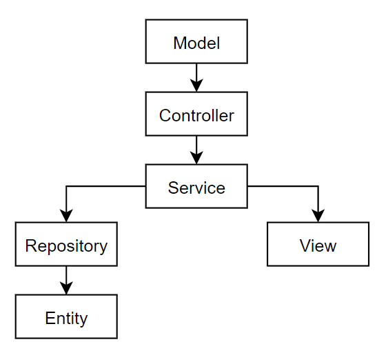

# Описание проекта
Архитектуру приложения обеспечивает  Framework Spring MVC.

**Model** - объединяет данные приложения.  
**View** - отвечает за отображение данных Model. 
**Controller** - обрабатывает запрос пользователя, создаёт 
соответствующую Модель и передаёт её для отображения в Вид.

###Классы:

**@Entity** - указывает на класс, который на абстрактном
уровне коррелирует с таблицей в базе данных. 
**@Service** 
**@Controller** 
**@Repository** 

@Configuration
@Application

###Принцип работы программы:
**Model** - Запрос от браузера (пользователя) 
**Controller** - Обрабатывает входящий запрос. 
Выбирает нужный метод, который будет обрабатывать запрос. 
**Service** - Код-логика. Обрабатывает входящий запрос. 
**View** - Макет страницы, который возвращается по 
цепочке обратно пользователю. 
**Repository** - Репозиторий. Работает с базой данных. 
**Entity** - Сущность со всемми необходимыми данными. 
Пример: таблица с данными о пользователе. 

Приложение имеет гипперссылку (...) 